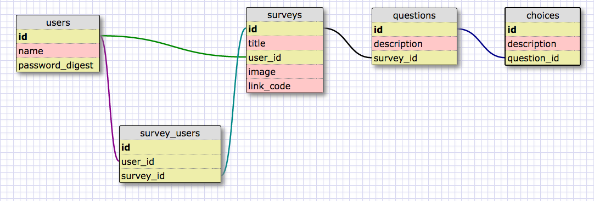
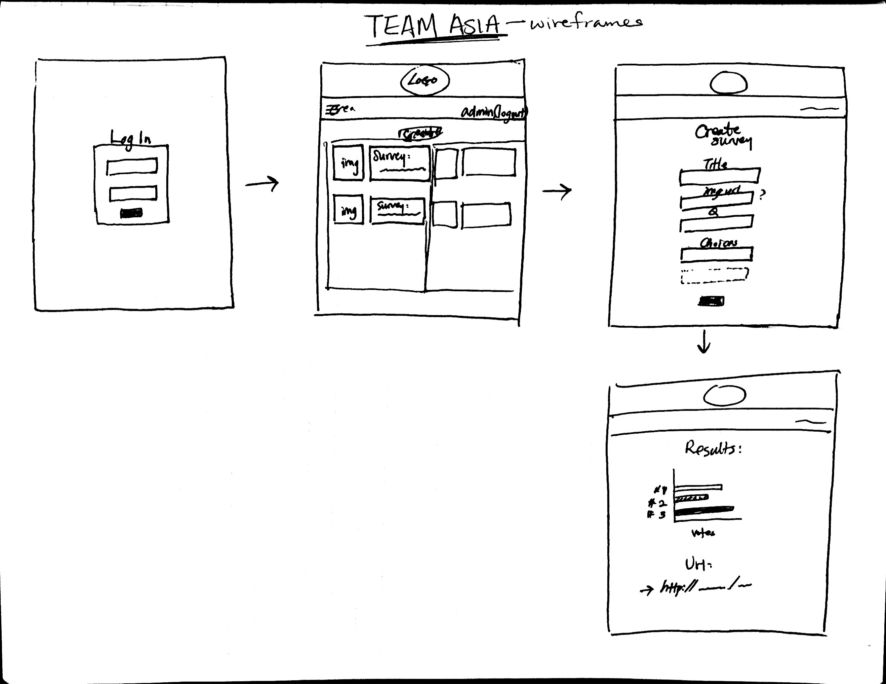

# survey-gorilla

User Stories

User needs to login to create/take survey

User can create survey
  User can create questions
  User can add multiple choices per question
  Select only one choice per question
  User can copy link to send out

User can take survey
  Make sure they can only select one choice

Anyone can view results of survey
  List out each question
  Display choices in a chart
    Horizontal bar graph in html

Creator can associate an image with survey

Creator can view profile of past surveys that they have posted

# Schema


# Wireframe


# Schema XML
```xml
<?xml version="1.0" encoding="utf-8" ?>
<!-- SQL XML created by WWW SQL Designer, http://code.google.com/p/wwwsqldesigner/ -->
<!-- Active URL: https://socrates.devbootcamp.com/sql -->
<sql>
<datatypes db="mysql">
  <group label="Numeric" color="rgb(238,238,170)">
    <type label="Integer" length="0" sql="INTEGER" re="INT" quote=""/>
    <type label="Decimal" length="1" sql="DECIMAL" re="DEC" quote=""/>
    <type label="Single precision" length="0" sql="FLOAT" quote=""/>
    <type label="Double precision" length="0" sql="DOUBLE" re="DOUBLE" quote=""/>
  </group>

  <group label="Character" color="rgb(255,200,200)">
    <type label="Char" length="1" sql="CHAR" quote="'"/>
    <type label="Varchar" length="1" sql="VARCHAR" quote="'"/>
    <type label="Text" length="0" sql="MEDIUMTEXT" re="TEXT" quote="'"/>
    <type label="Binary" length="1" sql="BINARY" quote="'"/>
    <type label="Varbinary" length="1" sql="VARBINARY" quote="'"/>
    <type label="BLOB" length="0" sql="BLOB" re="BLOB" quote="'"/>
  </group>

  <group label="Date &amp; Time" color="rgb(200,255,200)">
    <type label="Date" length="0" sql="DATE" quote="'"/>
    <type label="Time" length="0" sql="TIME" quote="'"/>
    <type label="Datetime" length="0" sql="DATETIME" quote="'"/>
    <type label="Year" length="0" sql="YEAR" quote=""/>
    <type label="Timestamp" length="0" sql="TIMESTAMP" quote="'"/>
  </group>

  <group label="Miscellaneous" color="rgb(200,200,255)">
    <type label="ENUM" length="1" sql="ENUM" quote=""/>
    <type label="SET" length="1" sql="SET" quote=""/>
    <type label="Bit" length="0" sql="bit" quote=""/>
  </group>
</datatypes><table x="199" y="217" name="users">
<row name="id" null="1" autoincrement="1">
<datatype>INTEGER</datatype>
<default>NULL</default></row>
<row name="name" null="1" autoincrement="0">
<datatype>VARCHAR</datatype>
<default>NULL</default></row>
<row name="password_digest" null="1" autoincrement="0">
<datatype>VARCHAR</datatype>
<default>NULL</default></row>
<key type="PRIMARY" name="">
<part>id</part>
</key>
</table>
<table x="435" y="96" name="surveys">
<row name="id" null="1" autoincrement="1">
<datatype>INTEGER</datatype>
<default>NULL</default></row>
<row name="title" null="1" autoincrement="0">
<datatype>VARCHAR</datatype>
<default>NULL</default></row>
<row name="user_id" null="1" autoincrement="0">
<datatype>INTEGER</datatype>
<default>NULL</default><relation table="users" row="id" />
</row>
<row name="image" null="1" autoincrement="0">
<datatype>VARCHAR</datatype>
<default>NULL</default></row>
<row name="link_code" null="1" autoincrement="0">
<datatype>VARCHAR</datatype>
<default>NULL</default></row>
<key type="PRIMARY" name="">
<part>id</part>
</key>
</table>
<table x="641" y="105" name="questions">
<row name="id" null="1" autoincrement="1">
<datatype>INTEGER</datatype>
<default>NULL</default></row>
<row name="description" null="1" autoincrement="0">
<datatype>VARCHAR</datatype>
<default>NULL</default></row>
<row name="survey_id" null="1" autoincrement="0">
<datatype>INTEGER</datatype>
<default>NULL</default><relation table="surveys" row="id" />
</row>
<key type="PRIMARY" name="">
<part>id</part>
</key>
</table>
<table x="847" y="210" name="choices">
<row name="id" null="1" autoincrement="1">
<datatype>INTEGER</datatype>
<default>NULL</default></row>
<row name="description" null="1" autoincrement="0">
<datatype>VARCHAR</datatype>
<default>NULL</default></row>
<row name="question_id" null="1" autoincrement="0">
<datatype>INTEGER</datatype>
<default>NULL</default><relation table="questions" row="id" />
</row>
<key type="PRIMARY" name="">
<part>id</part>
</key>
</table>
<table x="383" y="364" name="survey_users">
<row name="id" null="1" autoincrement="1">
<datatype>INTEGER</datatype>
<default>NULL</default></row>
<row name="user_id" null="1" autoincrement="0">
<datatype>INTEGER</datatype>
<default>NULL</default><relation table="users" row="id" />
</row>
<row name="survey_id" null="1" autoincrement="0">
<datatype>INTEGER</datatype>
<default>NULL</default><relation table="surveys" row="id" />
</row>
<key type="PRIMARY" name="">
<part>id</part>
</key>
</table>
<table x="627" y="360" name="choice_users">
<row name="id" null="1" autoincrement="1">
<datatype>INTEGER</datatype>
<default>NULL</default></row>
<row name="choice_id" null="1" autoincrement="0">
<datatype>INTEGER</datatype>
<default>NULL</default><relation table="choices" row="id" />
</row>
<row name="user_id" null="1" autoincrement="0">
<datatype>INTEGER</datatype>
<default>NULL</default><relation table="users" row="id" />
</row>
<key type="PRIMARY" name="">
<part>id</part>
</key>
</table>
</sql>
```

